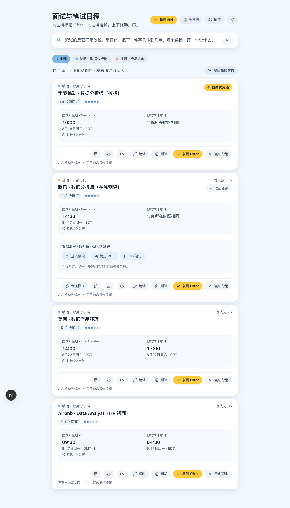
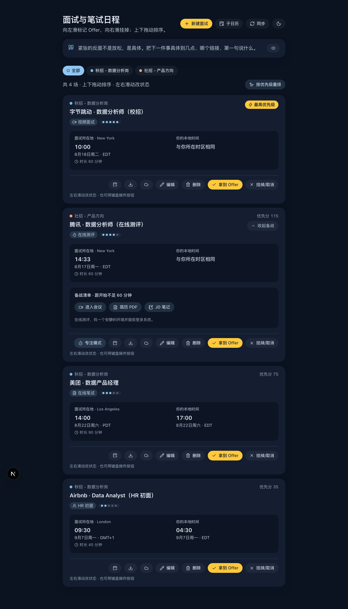
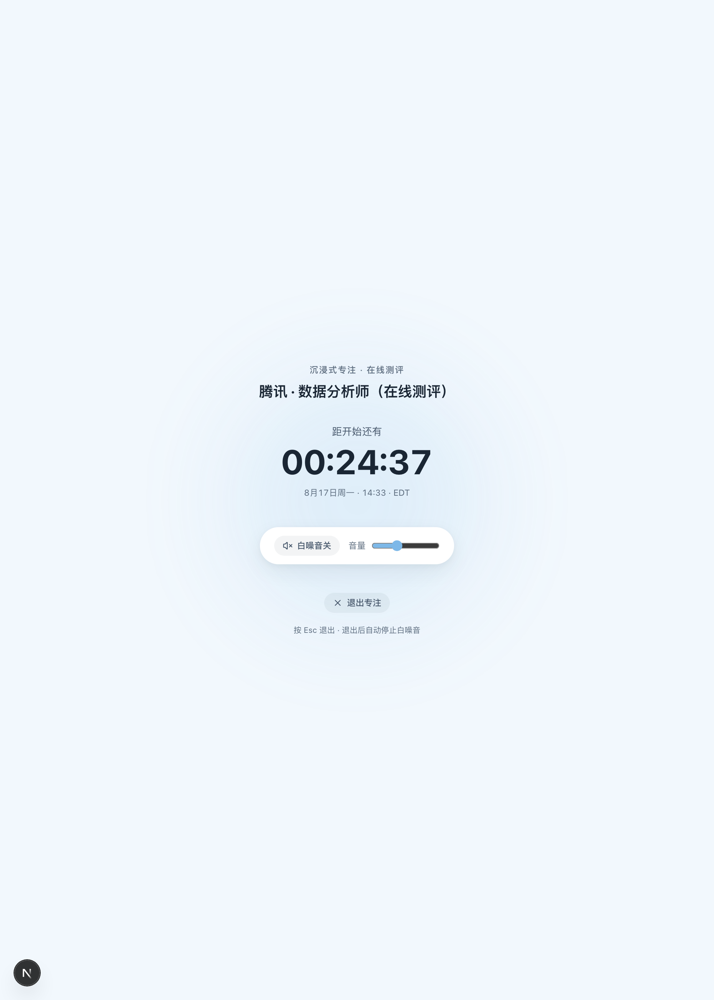
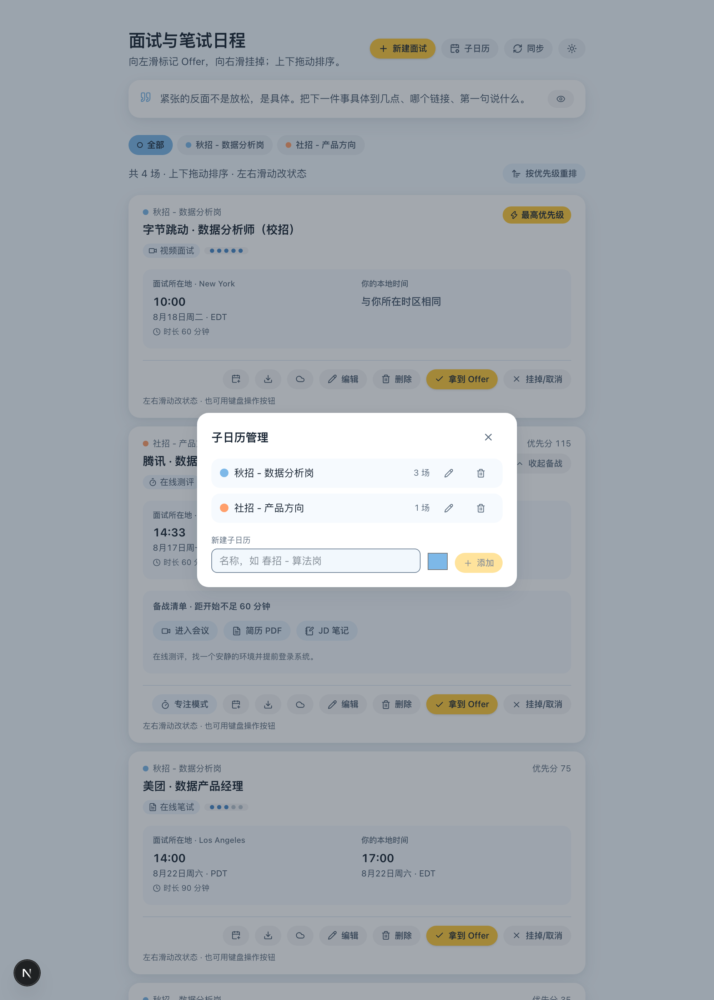

# 面试与笔试日程管理（Interview Scheduler）

一个帮助你管理面试/笔试日程的 Web 应用：**优先级排序、双时区、滑动改状态、拖拽排序、备战胶囊、专注模式、子日历管理**，并支持**一键同步到 Google 日历**（到点由 Google 自动发邮件/弹窗提醒）。

> 路线图见 [PROPOSAL.md](./PROPOSAL.md)：下一阶段将加入「账号登录（支持国内外多种邮箱 + Google 一键登录）」与「云端数据库 + 自动提醒」。

## ✨ 功能

- 左右滑动标记「拿到 Offer / 已挂」、上下拖拽排序（手势互不干扰，带方向锁定）
- 双时区展示（面试所在地时区 + 本机时区，Intl 自动处理夏令时）
- 距开始 ≤60 分钟自动展开备战胶囊（会议链接 / 简历 PDF / JD 笔记）
- 在线测评的沉浸式专注模式（全屏倒计时 + 呼吸灯 + 白噪音，Web Audio 实时合成）
- 面试/子日历增删改、优先级重排、已挂沉底；刷新后数据不丢（localStorage）
- 双主题（清醒蓝黄 / 暗黑极客），防 FOUC、WCAG AA 对比度
- **订阅日历**：每个账号一个私有订阅链接，手机自带日历（iPhone/华为/小米/三星）订阅后自动同步 + 原生提醒（提前 1 天/1 小时）
- Google 日历：免登录模板链接、.ics 导出、OAuth 推送/拉取（可选，配置见下）

## 🖼 截图

| 浅色 | 暗色 |
|---|---|
|  |  |

| 专注模式 | 子日历管理 |
|---|---|
|  |  |

## 🚀 本地运行

```bash
git clone <你的仓库地址>
cd interview-scheduler
npm install
# 需要本地 PostgreSQL（阶段 1 起账号与数据都在数据库）：
#   macOS: brew install postgresql@17 && brew services start postgresql@17
#   然后: createdb interview_scheduler
cp .env.example .env.local   # 生成 AUTH_SECRET 并填入 DATABASE_URL
npm run db:push              # 建表
npm run dev                  # http://localhost:3100
```

首次打开会进入登录页：**任意邮箱注册**（QQ / 163 / Outlook / Gmail 均可），新账号自动播种演示数据。

常用命令：`npm run typecheck`（tsc）· `npm run test`（单测）· `npm run build` · `npm run test:e2e`（需先起 dev + 数据库）· `npm run qa:visual`

## 🔗 连接 Google 日历（可选）

1. [console.cloud.google.com](https://console.cloud.google.com) 新建项目 → 启用 Calendar API
2. 「凭据 → 创建凭据 → OAuth 客户端 ID → Web 应用」，授权来源填 http://localhost:3100
3. 应用内右上角「同步」→ 粘贴 Client ID → 保存 → 「连接 Google 账号」授权

或写入环境变量 `NEXT_PUBLIC_GOOGLE_CLIENT_ID`（见 .env.example）。

## 🧱 技术栈

Next.js (App Router) · TypeScript (strict) · Tailwind CSS · Framer Motion · Zustand · Lucide · canvas-confetti · Vitest · ESLint · Puppeteer（e2e）

时间处理只用浏览器原生 Intl.DateTimeFormat，无第三方日期库。

## 📄 许可证

[MIT](./LICENSE)

## 🗺 部署

见 [docs/部署指南.md](./docs/部署指南.md)（GitHub → Vercel → Supabase，逐步图文指引）。
